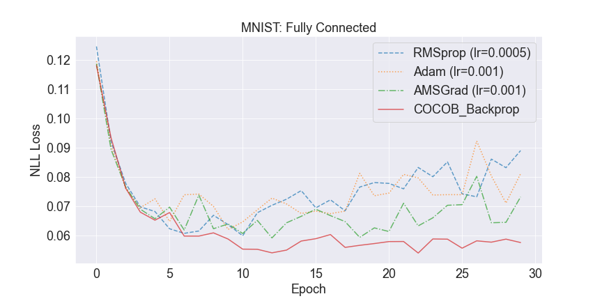

#  COntinuous COin Betting (COCOB) Backprop

[](https://paperswithcode.com/sota/stochastic-optimization-on-mnist?p=training-deep-networks-without-learning-rates)

Unofficial pytorch implementation of COCOB Backprop.

## Training deep networks without learning rates through coin betting
* [paper link](https://proceedings.neurips.cc/paper/2017/hash/7c82fab8c8f89124e2ce92984e04fb40-Abstract.html)

>Deep learning methods achieve state-of-the-art performance in many application
scenarios. Yet, these methods require a significant amount of hyperparameters
tuning in order to achieve the best results. In particular, tuning the learning rates
in the stochastic optimization process is still one of the main bottlenecks. In this
paper, we propose a new stochastic gradient descent procedure for deep networks
that does not require any learning rate setting. Contrary to previous methods, we
do not adapt the learning rates nor we make use of the assumed curvature of the
objective function. Instead, we reduce the optimization process to a game of betting
on a coin and propose a learning-rate-free optimal algorithm for this scenario.
Theoretical convergence is proven for convex and quasi-convex functions and
empirical evidence shows the advantage of our algorithm over popular stochastic
gradient algorithms.

## Usage

```
$ python main.py --optimizer=cocob_backprop --n_epochs=30
Epoch=0, train loss=0.3297, test loss=0.1180
Epoch=1, train loss=0.1448, test loss=0.0934
Epoch=2, train loss=0.1122, test loss=0.0762
Epoch=3, train loss=0.0937, test loss=0.0680
Epoch=4, train loss=0.0841, test loss=0.0653
Epoch=5, train loss=0.0742, test loss=0.0679
Epoch=6, train loss=0.0666, test loss=0.0599
...
```


